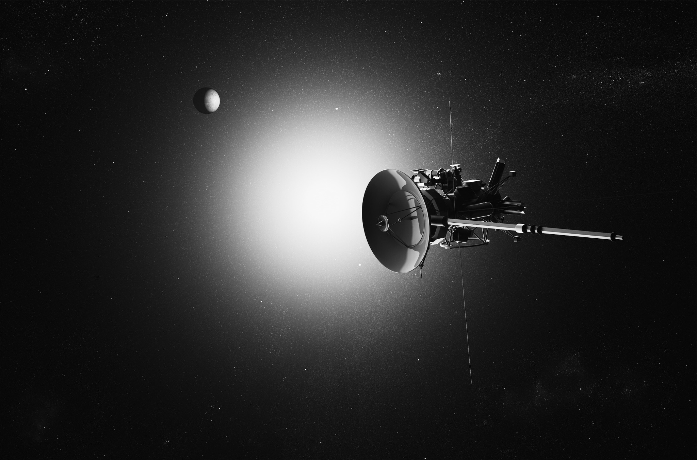
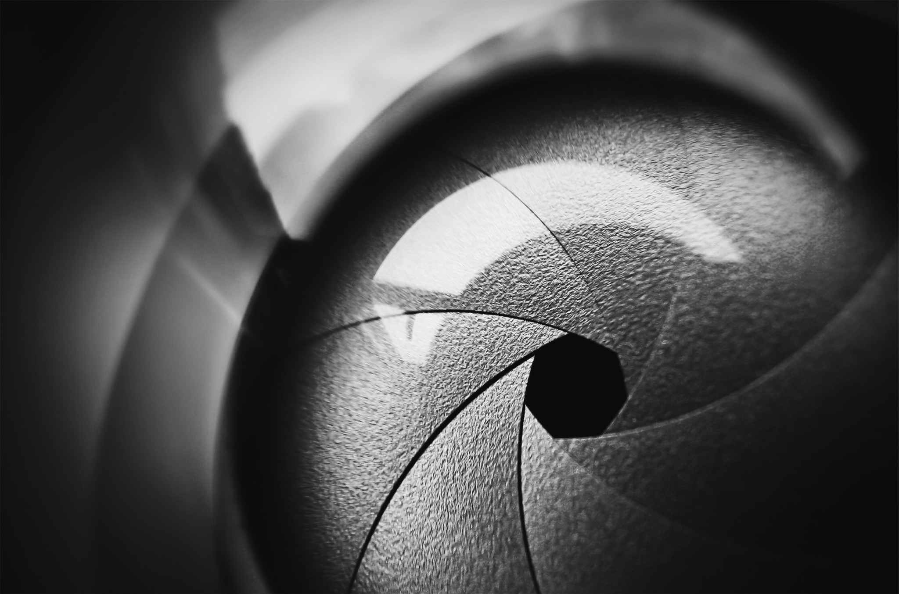

  # Shadow Sats

  

  

  

  

  

  

  

  

  

  

  

  

  

<!-- Photographs -->

  

  

  

  

  
  

  

  

<!-- Background color -->

  

  

<!-- Blockquote -->

  > We don’t know exactly what Kosmos 2542 is capable of, but Harrison speculates it could determine the aperture and resolution of the cameras on USA 245. If it has a radio-frequency probe, it could listen for faint signals from USA 245 to deduce what kinds of computer processes are happening onboard, when it’s operating, and when it is taking pictures.

